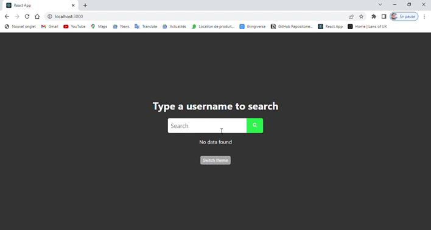

# Github search users clone with search repository functionality 

A react + redux app + typescript app, with a search system to retrieve github user by search and display their page.

 

# Table of contents

- [Installation](#installation)
- [Run](#run)
- [Recommended configurations](#recommended-configurations)
- [Uninstallation](#uninstallation)
- [Future improvments](#future-improvments)
- [License](#license)

# Installation

[(Back to top)](#table-of-contents)

* Clone this repo : git clone https://github.com/youssefchlendi/github-repositories-search
* Install dependencies : npm install

# Run

[(Back to top)](#table-of-contents)

* Run the app : npm run start
* Open the app : http://localhost:3000
* Search for a user by typing into the seach bar 
* Click on the user to see his page
* Have fun

# Uninstallation

[(Back to top)](#table-of-contents)

Simply delete the folder

# Recommended configurations

[(Back to top)](#table-of-contents)
 
 I recommend to use the following configurations :

 Google chrome 
 Nodejs version : 14.19.0 
 Npm version : 6.14.16 

# Future improvments

[(Back to top)](#table-of-contents)

Using graphQl is a good idea to retrieve data from the api.
maybe I will add a graphQl api in the future.

